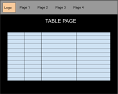

# Design Details 🍦
## Table of Contents
* [Deliverable 1](#deliverable1)
  1. [API Module Development](#apidev)
  2. [Module Interactions](#modint)
  3. [Development Stack](#devstack)
* [Deliverable 2](#deliverable2)
  1. [Final Architecture](#finarch)
  2. [Implementation Justification](#justif)
  3. [Challenges](#challenges)
* [Deliverable 4](#deliverable4)
  1. [Use Cases](#usecases)
  2. [Requirements](#requirements)
  3. [Design and Implementations](#desandimp)
  4. [Justification](#finjust)
## Deliverable 1 🥓 <a name="deliverable1"></a>
### API Module Development <a name="apidev"></a>
Question: *Describe how you intend to develop the API module and provide the ability to run it in Web service mode*

The first step is to make a detailed list of endpoints, describing exactly what format the response will be in and what information is being passed back by each endpoint. If we’re unclear about what each endpoint of the API does then in development we may run into issues such as redundant endpoints or confusing parameters. This step can be broken down a bit more:
1. Figure out what the broad scope of our API and app will be
2. List all the information we want to provide and actions we want to make possible for API users (identify all the endpoints)
3. Design the schema for the parameters and response of each endpoint
4. Make example data to show how it can be used and what type of information will be passed back
5. Fill out the documentation on Stoplight in a way that’s useable by others

Once our documentation is sorted out, we can begin actually creating these endpoints. At first, we will only return dummy data or perform superficial operations, but once every endpoint exists, we can go into making each one fully functional. After the design phase it will become apparent that some endpoints should be made before others, either because they are more useful or they are a base we can work off of for harder endpoints. The endpoints can be split up between group members, and each one can work on a set of related endpoints. The first few can also be done as a group, so we can establish a style and consistency in our code.

Stoplight lets us run a mock server that will provide example responses to api calls. When we create our API we’ll also need to run it on a live server to allow other teams to access it. Our team will make use of Amazon Web Services for easy and convenient hosting of our API, in particular using AWS Lambda. This service lets us host an API cheaply, only charging us for calls made to it, and is designed for small APIs like ours.

### Module Interactions <a name="modint"></a>
Question: *Discuss your current thinking about how parameters can be passed to your module and how results are collected. Show an example of a possible interaction. (e.g.- sample HTTP calls with URL and parameters)*
#### Request Details
**GET** http://sengmcnuggets.com/query
| Field      | Description                                                                                                 | Example             |
| ---------- | ----------------------------------------------------------------------------------------------------------- | ------------------- |
| start_date | The earliest date for which the user wants disease reports to be returned in the format yyyy-MM-ddTHH:mm:ss | 2015-10-01T08:45:10 |
| end_date   | The latest date for which the user wants disease reports to be returned in the format yyyy-MM-ddTHH:mm:ss   | 2015-11-01T19:37:12 |
| key_terms  | A comma separated list of all the key terms the user wants diseases reports about                           | Anthrax,Zika        |
| location   | Location name (city/country/state), which is a string to be matched with the content in the disease report  | Sydney              |

#### Respone Details
Overall Response:
```javascript
{
	articles: [<object::article>] // An array of article objects
}
```
Article Object:
```javascript
{
	url: <string>, // The url of the article
	date_of_publication: <string>, // The date the article was published
	headline: <string>, // The headline of the article
	main_text: <string>, // The main body of the article
	reports: [<object::report>] // An array of report objects
}
```

Report Object:
```javascript
{
	diseases: [<string::disease>], // the diseases relating to the report
	syndromes: [<string::syndrome>], // the syndromes relating to the report
	event_date: [<string>], // the date on which the case occurred
	locations: [<object::location>] // all the locations mentioned in the report referring to the case
}
```

Location Object:
```javascript
{
	geonames_id: <number> // the id of the location from the geonames database
}
```

event_date and date_of_publication dates are in one of two formats:
1. In the case of a single date, the format “yyyy-mm-dd hh:mm:ss” with the year always being present while every other segment is optional and uses ‘x’ if the character is missing
2. In the case of a date range, the format “yyyy-mm-dd hh:mm:ss to yyyy-mm-dd hh:mm:ss” is used with the years always being present while every other segment is optional and uses ‘x’ if the character is missing. The first date must be earlier than the second date

Example request:
> http://sengmcnuggets.com/query?start_date=2015-10-01T08:45:10&end_date=2015-11-01T19:37:12&keyterms=Anthrax,Zika&location=Sydney

Example Response (*Note:  this response is not related to the example request and is just an example of what a response would look like*)
```javascript
{
   "articles": [
       {
           "url": "https://www.cbsnews.com/news/ebola-monitoring-program-u-s-considering-as-new-cases-reported-in-africa/",
           "date_of_publication": "2021-02-26 21:17:xx",
           "headline": "U.S. to implement Ebola monitoring program at airports as new cases reported in Africa",
           "main_text": "The U.S. will soon be monitoring travelers coming into the country from two nations impacted by the Ebola virus, the Centers for Disease Control and Prevention announced Friday. The CDC confirmed these plans after CBS News first reported the details on Friday night.",
           "reports": [
               {
                   "diseases": ["ebola haemorrhagic fever", "zika"],
                   "syndromes": ["Haemorrhagic Fever"],
                   "event_date": "2021-01-19 xx:xx:xx to 2021-02-12 xx:xx:xx",
                   "locations": [6354908,2154855]
               }
           ]
       },
       {
           "url": "https://www.sample.com/news/influenza-outbreak",
           "date_of_publication": "2020-xx-xx xx:xx:xx",
           "headline": "Influenza Outbreak in Tokyo",
           "main_text": "Tokyo suffering from worst Influenza epidemic in recorded history",
           "reports": [
               {
                   "diseases": ["influenza a/h5n1"],
                   "syndromes": ["Haemorrhagic Fever", "Acute Flacid Paralysis"],
                   "event_date": "2020-xx-xx xx:xx:xx",
                   "locations": [1850147]
               }
           ]
       }
   ]
}
```

### Development Stack <a name="devstack"></a>
Question: *Present and justify implementation language, development and deployment environment (e.g. Linux, Windows) and specific libraries that you plan to use.*
#### Languages
These are the languages we have experience in:
| Name | James | Luke | Kenneth | Liam |
|------|-------|------|---------|------|
| Languages | <ul><li>Java</li><li>Python</li><li>C</li><li>HTML5/JavaScript</li><li>C#</li><li>C++</li><li>SQL</li><li>Bash</li></ul> | <ul><li>C#</li><li>Python</li><li>C</li><li>JavaScript</li></ul> | <ul><li>Python</li><li>C</li><li>Perl</li><li>Java</li><li>MIPS</li><li>Shell</li><li>SQL</li></ul> | <ul><li>Python</li><li>Java</li><li>Perl</li><li>JavaScript</li><li>C</li></ul> |

Pros and Cons of Languages for APIs:
| Language | Pros | Cons |
|----------|------|------|
| Python | <ul><li>Easy API calls through web development frameworks such as Flask</li><li>Readability - easy to learn and understand</li><li>Supports both procedural and object-oriented programming</li><li>Can be run on multiple platforms</li><li>Automatic memory management</li><li>Simplified unit testing</li></ul> | <ul><li>Relatively slow performance</li><li>High memory consumption due to flexibility of data types</li><li>Has errors that only show up in runtime as language is dynamically typed</li><li>Needs large degree of unit testing</li></ul> |
| Java/C# | <ul><li>Relatively high performance</li><li>Compiled</li><li>Statically typed so errors can be detected during runtime</li><li>Object oriented - offers maintainability and modularity</li></ul> | <ul><li>Not as readable and beginner friendly as python</li></ul> |
| JavaScript (Full Stack) | <ul><li>Covers full stack of development</li><li>Manages backend and frontend</li><li>Common language allows for better team efficiency with less resources</li><li>Extensive code reusability</li><li>Relatively high performance</li></ul> | <ul><li>Insufficiency with computation-heavy back end</li><li>The drawback of each item in the stack causes framework to have to inherit the flaws of each part</li></ul> |
| C/C++ | <ul><li>High performance and efficient</li><li>Statically typed so errors can be detected during runtime</li></ul> | <ul><li>Need to manually manage memory</li><li>Commonly used to be platform specific</li><li>Can be more complex and therefore harder to use</li></ul> |
| SQL | <ul><li>Fast data lookup once it is stored</li></ul> | <ul><li>Backend database</li><li>Not for frontend use</li><li>Not used to crawl internet directly</li></ul> |

After evaluating the possible languages we could use for developing our API and Web App, we decided to use Python as it was the language that everyone in the team was relatively familiar with, and thus would allow all team members to contribute in the development of the program. Furthermore, with how Python filing works, it is very easy to import packages, allowing us to easily work on separate functions without reliance on others work.

Additionally, Python’s ease of use arising from its simple syntax and dynamic typing makes it easier to maintain and collaborate on, especially between five team members who have not worked together on a project of this scale before. With Python being interpreted rather than compiled, it is slower compared to languages such as C, C# or Java, however, due to the relatively small scale of this project, we believe the difference in performance would not be significant enough to outweigh the benefits Python brings. 
Additionally, python also has a large community of users as well as extensive libraries which will speed up the development process. 
Some of the libraries we will be using in this project include:
* **json**: a library for reading and producing JSON data. This is a common format for API input and output, meaning it will be an essential library during our development.
* **flask**: one of two major options for server development in Python. Due to this server only being a backend server, Flask will be a simple option and preferable to Django.
* **pytest**: one of the best options for unit testing in Python.
* **psycopg2**: if we use an SQL database, this will be how we connect to it and run associated code on it.
* **datetime**: for dates and/or times.
* **requests**: for making requests to websites and/or pages and/or other API’s.
* **selenium**: for requesting HTML from dynamic websites.

#### Operating System
| Operating System | Pros | Cons |
|----------|------|------|
| Linux | <ul><li>Linux being free and dominance of Unix on the internet lead to there being more Linux hosting, which leads to more web apps being written which may purposely or accidentally favour Linux</li><li>Available documentation, resources for support and problem solving reflect disproportionate use of Linux</li><li>Industry Standard OS</li><li>Linux is FOSS</li></ul> | <ul><li>Open source leads to more opportunity for attack and abuse</li><li>Can’t host any .NET or ASP programs</li></ul> |
| OS-X Server | <ul><li>Benefits for apple users</li><li>Access to some apple specific programs</li></ul> | <ul><li>Can’t host any .NET or ASP programs</li><li>On top of the cost of the macintosh OS, you then have to purchase the server program from the app store</li><li>Mostly used for small scale business organization</li></ul> |
| Windows Server | <ul><li>Proprietary and constantly getting security updates</li><li>Applications written in Windows-only languages like .NET or ASP must be run from a Windows server</li><li>Good all rounder</li></ul> | <ul><li>All rounder, but sometimes can’t do the same specifics that can be done on a linux host</li><li>Much harder to work with for the inexperienced</li><li>Proprietary, so costs money to set up and use, alongside the extra costs of server</li></ul> |

We have decided that we will be using Linux for our hosting system. Alongside being an industry standard, it is free and can be run in a VM or as a machine itself. Furthermore, with all of us having access to the CSE computers via VNC or UNSW computer labs, we can be certain that we all have the same local setup and ensure there won’t be any compatibility issues.

Furthermore, we are using a virtual env so that we are all working in the same area. To use this, a person must first install venv. Follow the instructions below:
* python3 -m pip install --upgrade pip
* python3 -m pip install virtualenv
* Whilst in the API folder, run this command: 
  * source SENG3011/bin/activate
* This will activate the environment. To check you’re in the correct env, check it with this command:
  * which python
  * Should output your current directory + API/SENG3011/bin/python
* To exit the environment, run the command deactivate

Instructions found here for other operating systems:
https://packaging.python.org/guides/installing-using-pip-and-virtual-environments/

## Deliverable 2 🥓 <a name="deliverable2"></a>
### Software Architecture <a name="finarch"></a>


### Database Schema


### Justification of Implementation <a name="justif"></a>

Prior to our final formulation of our API architecture, we had outlined many components that we had planned to use for our development stack here: <https://github.com/KennethMejico/SENG3011_McNuggets/blob/main/Reports/Design%20Details.md#devstack>

As detailed above, the planned architecture differs slightly from our final architecture, most notably we had changes in the following categories:

| Category | Planned | Final |
|----------|------|------|
|SQL Database| DB on AWS services|RDS DB on AWS Lambda|
|Online Backend|AWS Lambda/Elastic Beanstalk|AWS Lambda|
|Database Management System|PostgreSQL (psycopg2)|mySQL (mysql.connector)|
|Scraping|Requests/Selenium|Requests/BeautifulSoup|

-   SQL Database: We had initially planned on using an AWS database but were unsure of the limitations that other changes could impose. In completing further research and attempts at implementation, we had decided to go with Amazon Relational Database Service (RDS), as opposed to other AWS databases:

-   Relational (Aurora, RDS, Redshift): Used for traditional applications, ERP, CRM, e-commerce

-   Key-value (DynamoDB): High-traffic web apps, e-commerce systems, gaming applications

-   In-memory (ElastiCache): Caching, session management, gaming leaderboards, geospatial applications

-   Document (DocumentDB): Content management, catalogs, user profiles

-   Wide Column (Keyspaced): High scale industrial apps for equipment maintenance, fleet management, and route optimization

-   Graph (Neptune): Fraud detection, social networking, recommendation engines

-   Time series (Timestream): IoT applications, DevOps, industrial telemetry

-   Ledger (QLDB): Systems of record, supply chain, registrations, banking transactions

With respect to all use cases for each type of database, we believe that our API would best fall under the relational category as a 'traditional application', as well as for the fact that our database would be stored in SQL form. In comparison to other options under the relation database type, we chose RDS due to its ease of use and free tier availability. RDS is more cost effective in comparison to Aurora, where although Redshift does have a 2-month free trial, RDS and it's ease of use outweighs Redshift for our project's timeframe.

-   Web Server Hosting: Our team had initially attempted to use AWS Elastic Beanstalk but found that the number of errors and difficulty of working with uploaded code made this approach sustainable. With this in mind, we opted to use AWS Lambda as it was much easier to set up and utilise.

-   Database Management System: The main reason for a change in our database system was mainly the result of developer preference, i.e. the group member working on the SQL database had more experience using MySQL as opposed to PostgreSQL, and therefore a greater preference for the former.

-   Scraping: Our initial plan had involved using requests and Selenium, though through further development on the scraper, there was better familiarity and ease in mainly using requests, as well as BeautifulSoup for HTML parsing.\
Here is the final architecture of our development stack:

#### Final Architecture:
|Category|Used Component|
|----------|------|
|Data Source|ProMedMail.org|
|Backend Language|Python|
|Web Scraping|Requests/BeautifulSoup Libraries|
|Web Framework (Local hosting only)|Flask|
|Operating System|Linux|
|Online Backend|AWS Lambda|
|Database Management System|MySQL|
|MySQL Database|AWS Relational Database Service (RDS)|
|Data Formatting|JSON|
|Testing|Pytest library|
|Misc. Libraries|datetime, mysql.connector, relativedelta, time, re, sys, os|\

Due to their respective components being given as default or necessary for the project, the following categories have not been given a comparison:

-   Data Source
-   Data Formatting
-   Misc. Libraries
-   Web Framework
-   Operating System

#### Backend Language
|Language|Pros|Cons|
|----------|------|------|
|**Python**|<ul><li>Easy API calls</li><li>Readability</li><li>Supports procedural and object-oriented programming</li><li>Can be run on multiple platforms</li><li>Automatic memory management</li><li>Simplified unit testing</li></ul>|<ul><li>Relatively slow performance</li><li>High memory consumption due to flexibility of data types</li><li>Has errors that only show up in runtime as language is dynamically typed</li><li>Needs large degree of unit testing</li></ul>|
|Java/C#|<ul><li>Relatively high performance</li><li>Compiled</li><li>Statically typed so errors can be detected during runtime</li><li>Object oriented - offers maintainability and modularity</li></ul>|<ul><li>Not as readable and beginner friendly as python</li></ul>|
|JavaScript|<ul><li>Covers full stack of development</li><li>Manages backend and frontend</li><li>Common language allows for better team efficiency with less resources</li><li>Extensive code reusability</li><li>Relatively high performance</li></ul>|<ul><li>Insufficiency with computation-heavy back end</li><li>The drawback of each item in the stack causes framework to have to inherit the flaws of each part</li></ul>|
|C/C++|<ul><li>High performance and efficient</li><li>Statically typed so errors can be detected during runtime</li></ul>|<ul><li>Need to manually manage memory</li><li>Commonly used to be platform specific</li><li>Can be more complex and therefore harder to use</li></ul>|
|SQL|<ul><li>Fast data lookup once it is stored</li></ul>|<ul><li>Backend database</li><li>Not for frontend use</li><li>Not used to crawl internet directly</li></ul>|

Justification: We had decided to use Python as our main programming language in developing our API and Web App, as it was the most familiar language for everyone. For the timeframe of the project, the ease of importing packages, less time spent on learning the language, and simple syntax of Python would provide a major advantage for much needed efficiency in the development stages.

#### Web Scraping
|Scraper|Pros|Cons|
|----------|------|------|
|Scrapy|<ul><li>Relatively fast - asynchronous</li></ul>|<ul><li>High learning curve</li><li>Unable to handle JavaScript by default</li></ul>|
|Selenium|<ul><li>Renders web pages for test automation</li><li>Useful in cases where websites rely on JavaScript</li></ul>|<ul><li> Wasn't originally designed for web scraping</li><li>Slower than HTTP requests</li></ul>|
|**Requests**|<ul><li>Low overhead</li><li>Makes simplified HTTP requests that are fast and use smaller amounts of data</li><li>Can query databases and web pages</li></ul>|<ul><li>Not very user friendly</li></ul>|

Justification: Using requests was a much easier option, despite Scrapy being much faster, and Selenium being able to work with the JavaScript used on the ProMedMail.org site. Being able to access the AJAX data of the website, we were able to use requests with much more efficiency.

#### Online Backend
|Backend|Pros|Cons|
|----------|------|------|
|**AWS Lambda**|<ul><li>Reduced cost of execution - only pay for computing costs</li><li>Improved resiliency - code is more resilient under load</li></ul>|<ul><li>No control over environment - unable to install packages or software on the environment</li><li>More complex call patterns - functions are timeboxed with timeouts</li></ul>|
|AWS Elastic Beanstalk|<ul><li>Completely automatic</li><li>Well integrated with AWS services</li><li>Good technical support from docs</li></ul>|<ul><li>Troubleshooting is difficult - unable to see where errors occur</li></ul>|

Justification: As mentioned above, we had chosen to use the AWS RDS as our form of database hosting, and as a result, we had two main choices between AWS Lambda, and AWS Elastic Beanstalk. Elastic Beanstalk was our first choice, as it has the ability to upload whole packages of code, have it run on a preconfigured server, and has a fairly long free trial. However, due to problems regarding configuration, we had decided to abandon Elastic Beanstalk and use Lambda instead, further can be read here: INSERT LINK TO CHALLENGES AND SHORTCOMINGS. 

#### Database Management System
|DBMS|Pros|Cons|
|----------|------|------|
|**MySQL**|<ul><li>Support for multi-user features</li><li>Simple read-heavy operations</li><li>Simple to install and use with broad community</li></ul>|<ul><li>Moves old data to rollback segments, performance is impacted with bulk INSERTs</li><li>Does not work well with long-running SELECTs</li><li>Lack of full-text search and slow concurrent read-writes</li></ul>|
|PostgreSQL|<ul><li>Parallel processing capability - can run long SELECTs unlike MySQL</li><li>Multi-user features</li></ul>|<ul><li>Storage engine needs extensive work</li><li>More power hungry</li></ul>|
|SQLite|<ul><li>Small footprint - compact with library under 600KB</li><li>Cache data from client/server locally</li></ul>|<ul><li>Lack of multi-user capabilities</li><li>Is file-based, can cause issues with larger datasets</li></ul>|

Justification: Despite the parallel processing capability of PostgreSQL, we had chosen to use MySQL as it was more familiar to us as a group. It would also be more time efficient, as members already had knowledge on how to set up MySQL databases, whereas precious time to learn to set up PostgreSQL would be wasted.

#### Database Hosting
|SQL DB|Pros|Cons|
|----------|------|------|
|**AWS RDS**|<ul><li>is cheaper because of its simplicity and lower scaling capabilities</li><li>no significant application changes are required </li></ul>|<ul><li>lower scaling capabilities</li><li>Shell access to the underlying operating system is disabled</li><li>access to MySQL user accounts with "SUPER" privilege isn't allowed</li></ul>|
|AWS Aurora|<ul><li>with Aurora there is no need for capacity planning. Aurora storage will automatically grow, from the minimum of 10 GB up to 64 TiB</li><li>With Aurora, you can provision up to fifteen replicas compared to just five in RDS MySQL</li></ul>|<ul><li>There is a big performance penalty in workloads where heavy writes that update secondary indexes are performed</li><li>Aurora Serverless is better for dev environments or systems which are needed for just a few hours/day or a short period of time</li><li>Aurora instances will cost you ~20% more than RDS MySQL. </li></ul>|
|AWS Redshift|<ul><li>Very strong load control</li><li>Petabyte scale data storage</li></ul>|<ul><li>Pricing is relatively very expensive</li><li>High maintenance because of its complex architecture</li><li>Redshift needs some administrative tasks to be executed manually by the cluster administrator. </li><li>Relatively slow results</li></ul>|

Justification: Our group had chosen RDS as it was the cheapest option, where Aurora instances would cost 20% more than RDS, and Redshift prices would be very expensive, despite there being a free trial. Redshift seems to require high maintenance and has slow results, so choosing RDS was our best option.

#### Testing
|Testing Tool|Pros|Cons|
|----------|------|------|
|**PyTest**|<ul><li>Prior experience</li><li>Intuitive yet flexible with decorators</li><li>Is actively developed and maintained. </li><li>It is compatible with both unittest and nose test suites</li><li>Has built-in test discovery </li><li>Has a large number of plugins available for use</li></ul>|<ul><li>Low compatibility with testing frameworks outside of the mentioned ones</li></ul>|
|Robot|<ul><li>Simple to use</li><li>Fast to write</li><li>Extendable</li><li>Open Source</li><li>Good for testing networked applications</li></ul>|<ul><li>Large overhead</li><li>Low Flexibility</li></ul>|
|unittest|<ul><li>Comes with Python</li></ul>|<ul><li>Simple. Very basic</li></ul>|
|DocTest|<ul><li>Comes with Python</li><li>Doctests often contain usage examples</li><li>You use the API of your code in the doctest before you actually use it for real</li></ul>|<ul><li>You can't run a subset of the tests.</li><li>If a failure happens in the middle of the doctest, the whole thing stops.</li><li>The coding style is stylized, and has to have printable results.</li><li>Your code is executed in a special way, so it's harder to reason about how it will be executed, harder to add helpers, and harder to program around the tests</li></ul>|

Justification: We had chosen to use PyTest as we all had experience using it during previous software engineering courses.

### Challenges Addressed and Shortcomings <a name="challenges"></a>

#### Multiple Reports per Article

One of the challenges we faced during the development of the API was how to store and process reports which have multiple locations, diseases and syndromes. Initially our solution involved having a Reports table that stored everything (locations, diseases, syndromes, keywords). However, we soon realised that this would result in multiple rows of the same report with the only difference being one disease, one syndrome, one location, or one keyword. To reduce the amount of redundant data we had to store, we decided to create joining tables Report_Locations, Report_Diseases, Report_Syndromes, and Report_Keywords which would only require us to store the ReportID and the other corresponding Id, reducing the amount of data we had to store. Additionally, these tables allow for flexibility in the future as it provides an easy way to isolate one field of a report. The shortcoming or downside associated with this is that it may result in slower performance as more joins are required, however, we did not see this as a significant issue as speed is not required for the purpose of our API as long as the request could be processed in a reasonable amount of time.

Furthermore, to properly generate multiple reports for a given article would involve natural text processing. This is not a feasible task to achieve on upwards of 20,000 individual articles, let alone write a script that could achieve this in a timely manner. Hence we had to look at other methods of generating reports from articles and collecting information about them.This lead to large amounts of problem solving that culminated in our final architecture and scraper operation.

#### Publishing the API

Our team encountered multiple issues while attempting to deploy the API publicly. Our initial plan was to create the API using Flask, and deploy it completely on AWS Elastic Beanstalk. The promises of using Elastic Beanstalk looked enticing - the ability to upload whole packages of code, have it run on a preconfigured server, and a fairly long free trial. However, like a mirage these hopes faded quickly when we ran into numerous issues configuring environment variables, importing external packages and even getting Elastic Beanstalk to identify our main file. When these issues were compounded with the inability to change code in any way other than completely reuploading the whole codebase, several minute long deployment times and a lack of documentation, we gave up on Elastic Beanstalk and looked to another Amazon Webservice, Lambda. We had previously experimented with Lambda in case we ran into issues with Elastic Beanstalk, so we were able to get Lambda working quickly enough to show off an example endpoint for our week five mentor session. We also found that during the switch to Lambda, it was easier to manually direct code to the appropriate endpoints (Using Amazon's API Gateway) than it was to figure out how to integrate Flask, and so the use of Flask was dropped when deploying to Lambda. This, along with a reorganisation of functions, is why we have included a zipped version of the code published to Lambda in our git repository, under the paths "Phase_1/API_SourceCode/lambda_endpoints.zip" and "Phase_1/API_SourceCode/lambda_database_updater.zip." This code integrates with Amazon's API Gateway and environment to receive event information and redirect it to the appropriate functions.

## Deliverable 4 🥓 <a name="deliverable4"></a>
For Stage 2 of the project, we have created a web application named 'NugSearch'. It is aimed to help inform users through visualised data that they may search for, using keywords, locations and dates. These visualisations may be in the form of a graph or heatmap, allowing users to make informative assumptions and ideas about the trends of certain diseases. Our web application also has an added feature of an alert system, which warns users if there is a possible outbreak for a disease in their area. For now, this system is limited to Australian COVID-19 cases, with hopes to implement the system to other areas of the world.

In this report, we outline the use cases and requirements achieved by our app, as well as a breakdown of its design and implementation. 

### Use Cases <a name="usecases"></a>
COVID-19 lockdowns have caused widespread economic recession, and dramatic increases in stress for everyday families. During the lockdown in Melbourne last year, an estimated [1200 jobs were lost daily and there was a 30% increase in demand for mental health services](https://www.bloomberg.com/news/articles/2020-10-28/city-locked-down-for-three-months-has-bleak-lesson-for-the-world). Nevertheless, the effectiveness of the lockdown in curbing cases indicates that lockdowns will continue to be used to control further outbreaks of COVID-19 and any future virulent disease. To both the ordinary person and corporations with a vested interest in the market, knowing when lockdowns are going to happen will greatly improve their chances of surviving them relatively unscathed.

There are two aspects to consider when predicting lockdowns. The first is the number/frequency of cases, and the second is the previous government response to previous epidemics and pandemics. Our application, Nugsearch, works with both of these aspects to keep users informed about the spread of diseases and the likelihood of lockdowns. Our application is built around a search feature that allows users to visualise the spread of infection and draw their own conclusions, and we also provide a feature that notifies users when our system believes a lockdown to be imminent.

Using our app, users can see the reports on diseases of interest and visualise that data in a graph to track the growth of infection and a map to see the areas threatened. They can sign up to a mailing list to receive notifications if our system detects a lockdown, and gain an edge that allows them to prepare to weather the oncoming events.

### Requirements <a name="requirements"></a>
#### Functional Requirements
Below we can see an ordered list of functional requirements. Our MVP is a product that we can use to search, and can display results in a table or graph.
| Requirement | Description | Result |
| --- | --- | --- |
| Search | Users can search for disease-related keywords with restrictions on time period and location. | Fully delivered: users can search for keywords with options to specify a date range and location. Input is made easier by a &quot;Find My Location&quot; button and date picker pop ups. |
| Reports Table | As a result of the search, users can see information about and links to relevant reports. | Fully delivered: users are able to see search results in a table format containing information regarding the disease report including: date, location, diseases, article headline, and url to the article. Additionally, the user is able to sort each column alphabetically and filter out results based on Article Headline, providing a better user experience. |
| Graph | Users can visualise the result of the search as a graph of cases over time. | Fully delivered: Users are able to view search results in the form of a Graph showing the number of reports (y axis) for a date (x axis), with each disease being represented by its own line. Users are also able to see the values for a data point by hovering over it. |
| Map | Users can visualise the result of the search on a map of cases in areas. | Partially delivered: The map works and will generate for any data from the backend - however the backend was not completed due to the high level of difficulty the task would require and time constraints. |
| Mailing | Users can subscribe to a mailing list to receive alerts. | Partially delivered: while users can sign up to a mailing list, the recurring alert scraper system was not configured to send email alerts yet. |
| Alert Notifications | Users can receive alerts while in the app. | Fully delivered: users can see notifications appear in the top right of several screens. The notifications contain a brief description of the state the alert is in and the nature of the alert, and can be clicked to go to a page with further details. |
| Alert Descriptions | Users can find relevant information about current alerts. | Fully delivered: users directed to the alerts page are provided with important data such as the latest local case number and weekly average of local cases for the specific Australian state, alongside potential symptoms to look out for. |

#### User interface requirements
The user interface needs to be clear and simple to understand so that anyone who uses our product would be able to understand it - especially considering that our product is designed to be used by the general public.
| Requirement | Explanation | Example | Final product |
| --- | --- | --- | --- |
| Multiple pages and navbar | Our website needs to be simple to navigate it&#39;s multiple pages, with each screen self evident of its purpose |  |  |
| Alerts are clear to see | We want alerts to be clear on our website as they will warn users about upcoming lockdowns. |  |  |
| Search is easy to use | The search function needs to be easy to use, with each field self explanatory of why it is being requested. |  |  |
| Table is easy to understand | The table of results from the search function should have simple to understand columns and information |  |  |
| Graph is simple to understand | The graph should be simple to view and interpret |  |  |
| Map is easy to understand | The map should present case locations from the search results visually, with an overlay displaying probability of lockdown. |  | |

### System Design and Implementation <a name="desandimp"></a>
#### WebApp Software Architecture
Our WebApp is made using a Python Flask backend and a React frontend built on JavaScript. The backend calls various external APIs such as the Google Maps Geocoding and Embed APIs as well as team BugsFreeSince93&#39;s API. Additionally, we have a separate scraper that collects data daily from the covidlive website.

| Component | Choice |
| --- | --- |
| Frontend Language | JavaScript, CSS |
| Frontend Framework | React |
| Backend Language | Python |
| Backend Web Framework | Flask |
| External APIs | Google Maps Geocoding API, Google Maps Embed API |
| SENG3011 Team API | BugsFreeSince93 |
| External Data Source | [https://covidlive.com.au](https://covidlive.com.au/) |
| JavaScript libraries/React Modules | nivo, react-table, react-router, react-datepicker |

### Justification of Design Choices <a name="finjust"></a>

#### Frontend Language

The choice of using JavaScript and CSS for the frontend of our web app was a natural and easy choice as there are not many alternatives to JavaScript that provide the same range of features and support as it does. Additionally, the extensive range of libraries available with JavaScript and available online support make development much faster and easier, making JavaScript the obvious choice.

#### Frontend Framework

For frontend development, there are many frameworks available in JavaScript that offer features that would reduce development time and the code required to write such features. We evaluated the frameworks of Vue and React along with Vanilla JavaScript (using no framework) in the table below. Both Vue and React are quite comparable in the features they offer and although Vue is easier to use and set up than React, our team decided to use React simply due to the team&#39;s prior experience with these frameworks which would eliminate part of the learning curve that comes with React.

| **Feature** | **Vanilla JavaScript** | **Vue** | **React** | **Relevance** |
| --- | --- | --- | --- | --- |
| **Ease of use** | Poor - have to manually write in features such as state management | Good - lightweight, easy to use | Good - although slightly steeper learning curve compared to Vue | High |
| **Maintainability** | Poor - have to manually keep UI in sync with state - a lot of code, low readability | Good with separate JavaScript, HTML, CSS files | Good - use react components | High |
| **State Management** | No | Yes | Yes | High |
| **Routing** | No | Yes | Yes | High |
| **Virtual DOMs** | No | Yes | Yes | Moderate |
| **Documentation** | Moderate | Good | Good with large community | Moderate |
| **Scalability** | Poor - hard to scale up | Good - scales well both up and down | Good - scales up well, down not so good | Moderate |

#### Backend Language

We chose to use Python for our backend mainly due to its readability, modularity, portability, and extensive library support making it a suitable choice for developing a web app in such a short period of time. Additionally, Python is the language that everyone in the team has the most experience with which makes it the natural choice for this project as it would be unreasonable for a team member to have to learn a new language in a few weeks. Of course, the pros and cons of each language that we evaluated in the Deliverable 2 report (table below) still apply and as with Deliverable 2, we chose to use Python for our backend development.

| Language | Pros | Cons |
|----------|------|------|
| Python | <ul><li>Easy API calls</li><li>Readability</li><li>Supports procedural and object-oriented programming</li><li>Can be run on multiple platforms</li><li>Automatic memory management</li><li>Simplified unit testing</li></ul> | <ul><li>Relatively slow performance</li><li>High memory consumption due to flexibility of data types</li><li>Has errors that only show up in runtime</li><li>Needs large degree of unit testing</li></ul> |
| Java/C# | <ul><li>Relatively high performance</li><li>Compiled</li><li>Statically typed so errors can be detected during runtime</li><li>Object oriented - offers maintainability and modularity</li></ul> | <ul><li>Not as readable and beginner friendly as python</li></ul> |
| JavaScript | <ul><li>Covers full stack of development</li><li>Manages backend and frontend</li><li>Common language allows for better team efficiency with less resources</li><li>Extensive code reusability</li><li>Relatively high performance</li></ul> | <ul><li>Insufficiency with computation-heavy back end</li><li>The drawback of each item in the stack causes framework to have to inherit the flaws of each part</li></ul> |
| C/C++ | <ul><li>High performance and efficient</li><li>Statically typed so errors can be detected during runtime</li></ul> | <ul><li>Need to manually manage memory</li><li>Commonly used to be platform specific</li><li>Can be more complex and therefore harder to use</li></ul> |

#### Backend Web Framework

With choosing Python as our backend language, the main python web frameworks that are widely used are Flask and Django. A comparison of the two frameworks and the features they offer is included below. After evaluating each framework, we decided to use Flask due to its ease of use and set up making it suitable for making a small web app in the given time period. Additionally, the advantages and features Django have over Flask such as built-in input handling and validation were not required due to the small scale of our app. Hence, we chose the more lightweight Flask as our backend web framework.

| **Feature** | **Flask** | **Django** | **Relevance to Project** |
| --- | --- | --- | --- |
| **Mapping URLs to views** | Yes with support for function and class-based views | Yes with support for function and class-based views | High |
| **Ease of use** | Good - easy to use and set up | Moderate - harder than Flask | High |
| **Flexibility** | Good - flexible app structure; large availability of extensions | Moderate - requires consistent app structure | Moderate |
| **Performance** | Good - smaller and has fewer layers than Django | Not as good as Flask but comparable | Moderate |
| **Input handling, client and server side validation of forms** | No, but can be done through extensions | Yes with handling of various security concerns such as CSRF, XSS, and SQL injection | Moderate - Low |

#### External APIs

##### Google Maps Javascript Mapping API

The Google Maps Javascript Mapping API allows us to generate a dynamic map for our user at runtime depending on their selection criteria and chosen data points. Whilst there are alternatives to this API for mapping, such as Openlayers and TomTom, they don&#39;t feature all the functionality that we require and have as much ease of use. For example: you cannot search for locations through the Openlayers API and whilst there is documentation for the TomTom API, there isn&#39;t much community support for it - making developing in it, relatively speaking, very difficult. Alongside this, we are also already using the Google API suite for another function, hence minimizing the services that we require by using this API. Hence the choice of using the Google Maps Javascript Mapping API becomes a natural one.

##### Google Geocoding API

One feature that we wanted to implement in our program was the ability for a user to easily enter their location, maybe even with the click of a button, so that they would receive results tailored to them. To do this, we would need to do geo-encoding and geo-decoding. There are a lot of options out there, such as the Australian Geocoder API and the Mapbox Geocoding API. We decided to go with the Google Geocoding API for a variety of reasons. Firstly: it allows for generalization of our product. Even though we are starting only in Australia, we would eventually want to expand the product worldwide. Which means the Australian Geocoder API would not be suitable. Secondly, the Google Geocoding API is quick to start with and has a large amount of both documentation and community support. This means that the effects of the learning curve are minimized and the development speed is faster - which in a time sensitive project like this one is important. This is what makes it better for our project then the Mapbox Geocoding API. Last but not least, we are using the Google Maps Javascript Mapping API already to display user results, so using this API minimizes the number of services we require - allowing for faster development and more streamlined code.

##### SENG3011 Team API

For our web app, we chose to use team BugsFreeSince93 API for our search results as their API returns a large number of results within the provided time period from the Promed data source. However, the results disease and syndrome list were often empty and the API seemed to lack any form of key terms searching. Although other teams provided better search functionality and quality of results, they often did not return many results, sometimes only 1 report within a month&#39;s time period. As one of the main functionality of our web app is to display the search results in a table, graph, and map, we decided that the many results from the BugsFreeSince93 API would be most suitable for demonstrating this functionality. To mitigate the limited filtering of the API, we implemented filter and search functionality on our results page, allowing users to filter out any unwanted results.

#### External Data Sources

##### Covid Live

[Covidlive](https://covidlive.com.au/) is a website that helps inform users about COVID-19 cases, which is updated daily. The site mainly shows Australian data and includes information from different states. The website would deem useful for our project as it had data for the number of local cases of the virus each day, this would help us in creating triggers for our alerts and our prediction system. We had used a scraper to extract the data and calculated specific thresholds for the latest local case number and weekly average for each state, all of which was based on recent lockdowns. As the data is scraped daily, the alert system will display alerts for the user from different states which may have surpassed the threshold.

##### JavaScript Libraries/React Modules

Nivo was used for generating the line graph in our web app for two main reasons. Firstly, Nivo has an interactive documentation with examples containing source code, allowing it to be easily used without needing to spend long periods of time reading documentation. The second reason was that Nivo has built-in styling, reducing the time spent on writing CSS for the graph.

With many table libraries available for generating tables in React, we chose to use React-table as it is simple and lightweight compared to many of its alternatives. It also provides easy customisation and features such as searching and sorting. However, due to it&#39;s lightweight nature, it does feature a simple design with minimal styling which was a disadvantage of using the library. This was easily fixed with applying our own CSS to the component. Similarly, React-Datepicker was used as a simple react extension that lets us add a date selection form without much hassle.

React-Router was used to create the appearance of multiple pages within our app. By using routes our app was able to support switching between a number of paths to display different react components while keeping a consistent navigation bar at the top of the screen. React-Router lets us treat each path as its own independent component while allowing us to change between components in sensible ways. As it has a simple to grasp syntax and a solid amount of documentation and support, it was the natural choice for serving up a multi page application.
